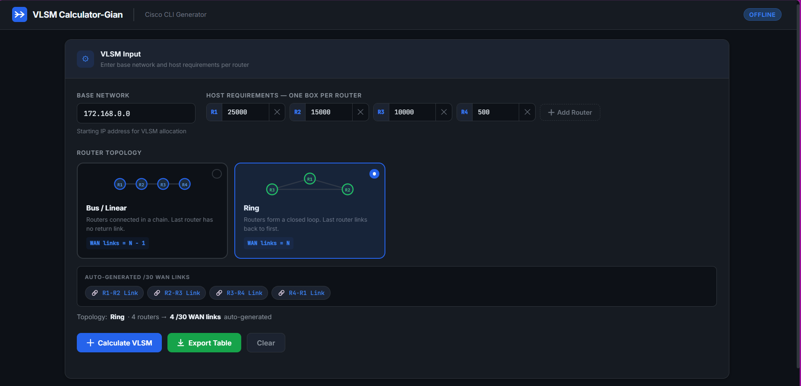
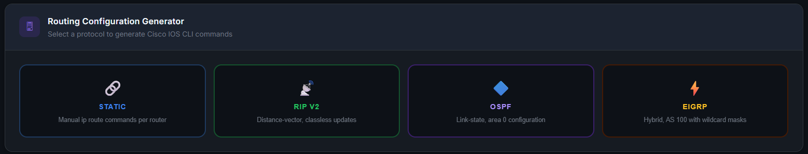
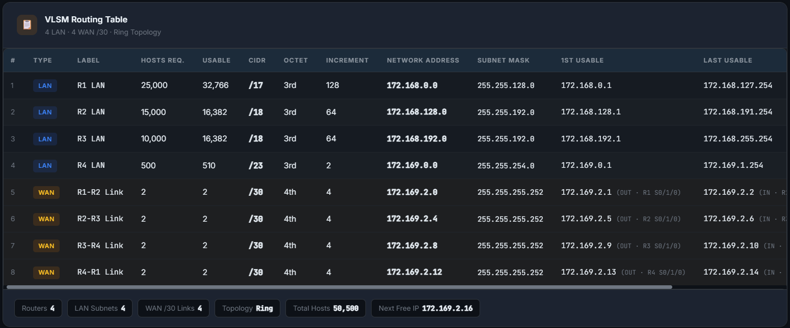

# VLSM Calculator with Routing Configuration Generator



> A fully offline, browser-based VLSM (Variable Length Subnet Masking) calculator that automatically generates complete Cisco IOS router configurations — ready to paste directly into Packet Tracer or a real Cisco router.

---

## 📋 Table of Contents

- [Description](#description)
- [Features](#features)
- [Screenshots](#screenshots)
- [Usage](#usage)
- [File Structure](#file-structure)
- [Technologies Used](#technologies-used)
- [How It Works](#how-it-works)
- [Port Assignment Rules](#port-assignment-rules)
- [Future Improvements](#future-improvements)
- [License](#license)

---

## Description

The **VLSM Calculator** is a professional-grade networking tool designed for Computer Engineering and Networking students. It solves two problems in one:

1. **Subnet Calculation** — Given a base network and host requirements per router, it allocates the smallest possible subnet for each using VLSM (largest-first allocation rule).

2. **Cisco CLI Generation** — It automatically generates complete router interface and routing protocol configurations, organized into Stage 1 (interfaces) and Stage 2 (routing), ready for immediate use in Cisco Packet Tracer or real IOS routers.

The tool supports **Static Routing**, **RIP v2**, **OSPF**, and **EIGRP** protocols, with Bus/Linear and Ring topology WAN link auto-generation.

---

## ✨ Features

| Feature | Details |
|---|---|
| 🔌 **Fully Offline** | No server, no API — runs entirely in the browser |
| 🧮 **VLSM Engine** | Accurate CIDR allocation using reference subnetting table |
| 🌐 **Topology Selector** | Ring or Bus/Linear — auto-calculates required /30 WAN links |
| 📡 **Auto WAN Links** | Generates exactly N (ring) or N−1 (bus) point-to-point /30 subnets |
| 🖥 **Cisco IOS CLI** | Pure, paste-ready CLI — no HTML, no spaces, no errors |
| 🔗 **Static Routing** | BFS-aware `ip route` generation per router |
| 📡 **RIP v2** | Classful network advertisements with `no auto-summary` |
| 🔷 **OSPF** | Area 0 wildcard-mask network statements |
| ⚡ **EIGRP** | AS 100 with wildcard masks and `no auto-summary` |
| 🔌 **Strict Port Logic** | OUT → `Serial0/x/0`, IN → `Serial0/x/1` — no conflicts |
| 🗺 **Connection Map** | Visual link diagram showing exact port and IP per router |
| 📋 **Copy Buttons** | Copy Stage 1, Stage 2, or both per router |
| ⬇ **Export Options** | Export CLI as `.txt` or `.xls`, export table as `.xls` |
| 🎨 **Professional UI** | Dark Cisco-inspired theme with responsive layout |

---

## 📸 Screenshots

### Main Application View


---

### Input Panel — Host Boxes and Topology Selector


> Enter your base network IP, add one host box per router, then select Bus/Linear or Ring topology. The WAN link preview updates automatically.

---

### VLSM Routing Table


> LAN subnets appear in blue rows. Auto-generated WAN /30 links appear in yellow rows, annotated with OUT and IN IPs and the assigned serial interface.

---

### CLI Terminal Output
.png)
.png)

> Each router gets a Stage 1 (interface config) and Stage 2 (routing protocol) block. A Connection Map at the top shows the exact port and IP assignment for every link.

---

### Topology Selector


> Choose Bus/Linear (chain, N−1 WAN links) or Ring (closed loop, N WAN links). The system dynamically previews the WAN links that will be generated before you calculate.

---

## 🚀 Usage

### Option 1 — Open directly in browser (recommended)

```bash
# Clone the repository
git clone https://github.com/yourusername/vlsm-calculator.git

# Open index.html in any modern browser
open vlsm-calculator/index.html
```

No build step, no npm install, no server required.

### Option 2 — Live Server (VS Code)

Install the **Live Server** extension in VS Code, right-click `index.html` → **Open with Live Server**.

---

### Step-by-Step Guide

**Step 1 — Enter Base Network**
```
172.168.0.0
```
This is the starting IP address for the entire VLSM block.

**Step 2 — Enter Host Requirements**

Add one input box per router. Each box represents one router's LAN:
```
R1 → 25000 hosts
R2 → 15000 hosts
R3 → 10000 hosts
R4 →   500 hosts
```
Click **+ Add Router** to add more boxes. Click **✕** to remove one.

**Step 3 — Select Router Topology**

| Topology | WAN Links Formula | Example (4 routers) |
|---|---|---|
| **Bus / Linear** | N − 1 | R1→R2, R2→R3, R3→R4 |
| **Ring** | N | R1→R2, R2→R3, R3→R4, R4→R1 |

The WAN link preview updates instantly as you change topology or add routers.

**Step 4 — Click Calculate VLSM**

The VLSM Routing Table appears showing:
- **Blue rows** — LAN subnets sorted largest to smallest
- **Yellow rows** — WAN /30 links with OUT/IN IP annotations

**Step 5 — Generate Routing Configuration**

Select a protocol button:
- 🔗 **Static** — `ip route` commands per router
- 📡 **RIP v2** — `router rip` + classful networks
- 🔷 **OSPF** — `router ospf 1` + wildcard networks `area 0`
- ⚡ **EIGRP** — `router eigrp 100` + wildcard networks

**Step 6 — Copy and Paste into Packet Tracer**

Use the copy buttons in the terminal panel:

| Button | What it copies |
|---|---|
| **⎘ Stage 1** | Interface configuration only |
| **⎘ Stage 2** | Routing protocol only |
| **⎘ Both** | Complete router configuration |
| **⎘ Copy All** | All routers combined in one block |

Paste directly into the Cisco router CLI. Commands are IOS-ready with no extra spaces or HTML.

---

## 📁 File Structure

```
vlsm-calculator/
│
├── index.html               ← Semantic HTML — no inline CSS or JS
├── style.css                ← Full dark theme, CSS variables
├── script.js                ← All logic — modular, fully commented
│
├── assets/
│   ├── icons/               ← Favicon files (favicon.ico, PNGs, manifest)
│   └── images/              ← Reserved for future UI images
│
├── exports/                 ← Placeholder for exported .txt and .xls files
│
├── docs/
│   └── screenshots/
│       ├── 1_preview.png             ← Main application view
│       ├── 2_table.png               ← VLSM routing table
│       ├── 3_dynamic_OR_static.png   ← Topology selector
│       └── 6_CLI(1).png             ← CLI terminal output
│
├── README.md                ← This file
├── LICENSE                  ← MIT License
└── .gitignore               ← Git ignore rules
```

---

## 🛠 Technologies Used

| Technology | Purpose |
|---|---|
| **HTML5** | Semantic structure, ARIA accessibility attributes |
| **CSS3** | Custom properties, Grid, Flexbox, keyframe animations |
| **Vanilla JavaScript** | All logic — zero frameworks, zero dependencies |
| **Google Fonts** | Inter (UI text) + JetBrains Mono (CLI/IP addresses) |
| **Clipboard API** | One-click copy to clipboard |
| **Blob API** | In-browser `.txt` and `.xls` file export |

---

## ⚙ How It Works

### VLSM Allocation Algorithm

1. Sort all host requirements **descending** (largest subnet allocated first — VLSM rule)
2. For each host count, find the smallest CIDR block where `usable ≥ hosts`
3. Allocate subnets sequentially from the base IP with no gaps
4. After all LAN subnets, assign one `/30` subnet per router-to-router link

### Topology WAN Link Count

```
Bus/Linear:  links = N − 1
             R1→R2, R2→R3, ..., R(N-1)→RN

Ring:        links = N
             R1→R2, R2→R3, ..., RN→R1
```

### Static Routing — BFS Next-Hop

For routers not directly adjacent to a destination network, the system uses **Breadth-First Search** across the serial link graph to determine the correct next-hop IP. This ensures accurate `ip route` entries even in ring topologies where some destinations are two or more hops away.

### CLI Output Rules

All generated CLI strictly follows Cisco IOS syntax:
- No leading spaces before commands
- Starts with `enable` + `configure terminal`
- `!` comment lines label each interface block (valid IOS syntax)
- Ends with `exit` from mode + `end`
- No HTML, no browser formatting artifacts

---

## 🔌 Port Assignment Rules

This tool enforces strict Cisco point-to-point serial conventions:

| Side | Role | Interface | IP from /30 |
|---|---|---|---|
| Link initiator | **OUT** | `Serial0/1/0` | First usable IP |
| Link receiver  | **IN**  | `Serial0/1/1` | Last usable IP  |

For routers with multiple serial links (ring topology):

| Link | OUT Interface | IN Interface |
|---|---|---|
| 1st link | `Serial0/1/0` | `Serial0/1/1` |
| 2nd link | `Serial0/2/0` | `Serial0/2/1` |

**Guarantees:**
- ✔ Every link has exactly one OUT port and one IN port
- ✔ No OUT↔OUT or IN↔IN conflicts possible
- ✔ `firstIP` of every `/30` always assigned to the OUT router
- ✔ `lastIP` of every `/30` always assigned to the IN router

## Example 
 .png)
 .png)


## 🔮 Future Improvements

- [ ] **Topology Visualization** — Interactive SVG diagram showing live router connections
- [ ] **Packet Tracer Export** — Generate `.pkt`-compatible configuration scripts
- [ ] **IPv6 Support** — VLSM for IPv6 prefix allocation
- [ ] **Auto Diagram Generator** — Printable network topology diagram
- [ ] **Save / Load** — JSON import/export of full calculator state
- [ ] **Dark/Light Theme Toggle** — Light mode for printing and documentation
- [ ] **Multi-area OSPF** — Support for multiple OSPF areas beyond area 0
- [ ] **Named EIGRP** — Support for modern named EIGRP configuration mode

---

## 👨‍💻 Author

Gian Carlo Trilles

---

## 📄 License

This project is licensed under the **MIT License** — see [LICENSE](LICENSE) for details.
